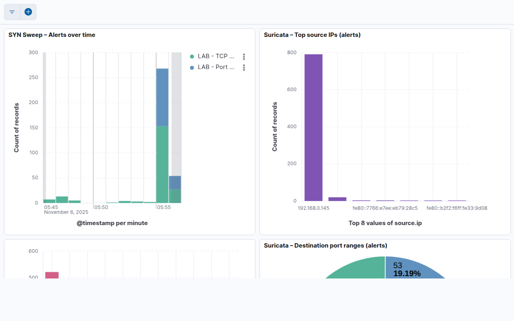

# Lab de Detecção de Varredura de Portas — Suricata → Filebeat → Elasticsearch → Kibana

[](README.md)
[](README.pt-BR.md)

Lab reprodutível para detectar varreduras TCP SYN com Suricata, enviar eventos via Filebeat para Elasticsearch e visualizar no Kibana Lens. Inclui regras locais, export de objetos do Kibana (NDJSON), scripts de health/backup/export/screenshots e documentação bilíngue.

> 🇺🇸 English-first docs: veja [README.md](README.md)


## Conteúdo

- [O que construí & por quê](#o-que-construí--por-quê)
- [Arquitetura e Justificativa](#arquitetura-e-justificativa)
- [Decisões de Design](#decisões-de-design)
- [Componentes e Versões](#componentes-e-versões)
- [Regras de Detecção (locais)](#regras-de-detecção-locais)
- [Runbook (Setup → Health → Tráfego → Teardown)](#runbook-setup--health--tráfego--teardown)
- [Scripts de automação](#scripts-de-automação)
- [Geração de Tráfego (Nmap)](#geração-de-tráfego-nmap)
- [Dashboard Kibana & KQL](#dashboard-kibana--kql)
- [Evidências & screenshots](#evidências--screenshots)
- [Exports (NDJSON) & reprodutibilidade](#exports-ndjson--reprodutibilidade)
- [Backup & snapshots](#backup--snapshots)
- [Hardening & operação](#hardening--operação)
- [Troubleshooting](#troubleshooting)
- [Estrutura do Projeto](#estrutura-do-projeto)
- [Galeria de screenshots](#galeria-de-screenshots)
- [Resultados & evidências](#resultados--evidências)
- [Licença, Conduta, Segurança](#licença-conduta-segurança)
- [Créditos](#créditos)

## O que construí & por quê
- Lab containerizado Suricata → Filebeat → Elasticsearch → Kibana focado em detectar varredura TCP SYN. Serve como peça defensiva complementar ao [Pentest Lab](https://github.com/fantasmagorikus/pentest-lab), que cuida da parte ofensiva com OWASP Juice Shop.
- Regras locais do Suricata: SYN básica (sid 9900001) + threshold (sid 9901001) para flagrar sweep do Nmap.
- Pipeline EVE JSON → Filebeat (módulo suricata) → data streams no Elasticsearch + dashboard Lens dedicado.
- Scripts para health check, snapshots/backup, export NDJSON, captura headless de screenshots e publicação em GitHub.
- `.env` alterna entre single-host (`lo`) e interface LAN; OWASP Juice Shop (porta 3000) fornece tráfego previsível.

Conte a mesma história ofensiva + defensiva do [Pentest Lab](https://github.com/fantasmagorikus/pentest-lab): Suricata detecta o Nmap enquanto a pipeline de evidências mostra os alertas no Kibana.

## Arquitetura e Justificativa

```
┌──────────────────────────────┐           ┌────────────────────────────┐
│ Suricata (EVE JSON)          │           │ Módulo Suricata do Filebeat│
│ network_mode: host           │──────────▶│ Data streams no ES         │
│ Regras locais 9900001/9901001│ alerts    └────────────┬────────────────┘
└─────────────┬────────────────┘                        │
              │ HTTP / ECS                              ▼
      ┌───────────────┐                          ┌───────────────┐
      │ Juice Shop    │◀───────────── tráfego ─▶│ Kibana Lens   │
      └───────────────┘                          └───────────────┘
```

- Suricata: IDS maduro que emite EVE JSON estruturado (alertas, flows, stats)
- Módulo Suricata do Filebeat: mapeamento ECS + data streams simplificam ingestão
- Elasticsearch/Kibana: busca rápida, KQL e Lens para visuais reprodutíveis
- Regras locais: detecções feitas sob medida para SYN e threshold de scan (Nmap)

## Decisões de Design

- Suricata + EVE JSON: IDS maduro com saída estruturada (alertas, flows, stats) que integra bem com ELK.
- Módulo Suricata do Filebeat: mapeamento ECS e data streams reduzem parsing/esquema customizado.
- Network mode (host) para Suricata: necessário para ver tráfego do host em Linux; alternado via `.env` para máquina única (lo) ou LAN (NIC).
- Regras locais: SYN básica + regra de threshold geram sinais claros de scan sem rulepacks pesados; fáceis de explicar e reproduzir.
- Kibana Lens + Saved Objects: iteração rápida e visuais portáveis; export NDJSON anexado ao release.
- Snapshots + scripts de backup: preservam estado e artefatos para demonstrações repetíveis e auditorias.
- Screenshots headless: evidências consistentes para portfólio sem captura manual.

## Componentes e Versões

- Suricata 8.x (container `jasonish/suricata:latest`)
- Filebeat 8.14.3 (container)
- Elasticsearch 8.14.3 (nó único, segurança desativada para o lab)
- Kibana 8.14.3
- OWASP Juice Shop (alvo) na porta `3000`

## Regras de Detecção (locais)

Definidas em `local-rules/local.rules`:

```
alert tcp any any -> $HOME_NET any (msg:"LAB - TCP SYN"; flags:S; flow:stateless; sid:9900001; rev:2;)
alert tcp any any -> $HOME_NET any (msg:"LAB - Port Scan (SYN threshold)"; flags:S; flow:stateless; detection_filter: track by_src, count 20, seconds 60; classtype:attempted-recon; sid:9901001; rev:1;)
```

- 9900001: detecção básica de SYN
- 9901001: alerta quando uma origem envia ≥20 SYN em 60s (by_src)

## Runbook (Setup → Health → Tráfego → Teardown)

Pré-requisitos (Linux): Docker, Docker Compose, `curl`, `jq`, `nmap`.

```bash
cd homelab-security/suricata-elk-lab

# 1) Configurar interface (single host = lo, LAN = sua NIC)
cp .env.example .env
# edite SURICATA_IFACE se necessário

# 2) Subir a stack
docker compose up -d

# 3) Health check + captura de logs
bash scripts/retomada_check.sh

# 4) Gerar tráfego (exemplo single host)
sudo nmap -sS -p 1-10000 127.0.0.1 -T4 --reason

# 5) Explorar dashboard
xdg-open http://localhost:5601

# 6) Encerrar
docker compose down -v
```

Makefile (atalhos): `make up | make health | make nmap-local | make screenshots | make backup | make down`

## Scripts de automação
- `scripts/retomada_check.sh` — health check com timestamp (serviços, logs, curls) e arquivo de saída.
- `scripts/backup.sh` — snapshot do ES + logs do Suricata + tar das configs + checklist “next steps”.
- `scripts/kibana_export_dashboard.sh` / `scripts/kibana_rename_dashboard.sh` — operações com Saved Objects.
- `scripts/capture_screenshots.sh` — Chromium headless captura painéis para README/portfólio.
- `scripts/publish_github.sh` — publica/atualiza o repositório via GitHub CLI (SSH).

## Geração de Tráfego (Nmap)

- Single host (loopback):
  ```bash
  sudo nmap -sS -p 1-10000 127.0.0.1 -T4 --reason
  ```
- LAN (a partir de outra máquina):
  ```bash
  sudo nmap -sS -p 1-1000 <IP_DA_VITIMA> -T4 --reason
  ```

## Dashboard Kibana & KQL

Abra o Kibana em `http://localhost:5601`.

- Data View (se solicitado):
  - Name: `filebeat-*`
  - Time field: `@timestamp`

- Dashboard: “Port Scan Detection (Suricata)”
  - Alerts over time (empilhado por signature)
  - Top source IPs (alerts)
  - Top destination ports (alerts)
  - Faixas de portas de destino (well-known/registered/dynamic)
  - Tabela de detalhes (Saved Search)

- KQL úteis:
```
event.module: "suricata" and suricata.eve.event_type: "flow"
event.module: "suricata" and suricata.eve.event_type: "alert"
suricata.eve.alert.signature_id: 9901001
```

## Evidências & screenshots
- PNGs do Kibana ficam em `docs/screenshots/` (regerar com `make screenshots`).
- `scripts/capture_screenshots.sh` salva versões prontas para usar em README ou entrevista.
- Combine com as evidências do [Pentest Lab](https://github.com/fantasmagorikus/pentest-lab) para mostrar a narrativa ofensiva + defensiva.

## Exports (NDJSON) & reprodutibilidade

Export de “Saved Objects” está em `kibana_exports/` (NDJSON). Importe para recriar o dashboard e objetos relacionados.

- Export (script):
```bash
bash scripts/kibana_export_dashboard.sh "Port Scan Detection (Suricata)"
```

- Import (UI): Kibana → Stack Management → Saved Objects → Import → selecione o `.ndjson` e confirme.

## Backup & snapshots

Crie snapshot do Elasticsearch e arquive configs do lab de uma vez:
```bash
bash scripts/backup.sh
```
Saída em `backups/<timestamp>/`: resposta do snapshot, logs do Suricata (se houver) e tarball das configs.

## Hardening & operação
- Suricata usa `network_mode: host`; ajuste `.env` conscientemente (sem assumir NIC padrão).
- Filebeat roda como root com `-strict.perms=false` para evitar erros de permissão com configs montadas.
- Elasticsearch/Kibana estão sem `xpack.security`; não exponha o lab em redes não confiáveis. Habilite segurança para uso prolongado.
- Armazene os volumes de snapshot (`es-snapshots`) e backups fora de discos efêmeros se rodar em nuvem.

## Troubleshooting

- Sem alertas após Nmap
  - Verifique se a interface condiz com o cenário (`lo` em máquina única, NIC na LAN)
  - Confirme regras carregadas e Suricata saudável (`docker logs suricata-lab-suricata`)
  - Aumente a intensidade do scan (`-p 1-10000`)

- Sem dados no Kibana
  - Verifique Filebeat config/output:
    - `docker exec suricata-lab-filebeat filebeat -e -strict.perms=false test config`
    - `docker exec suricata-lab-filebeat filebeat -e -strict.perms=false test output`
  - Cheque alcance de Elasticsearch/Kibana (portas 9200/5601)

- Fuso/tempo
  - Em Kibana, use timezone “Browser” e amplie a janela de tempo

## Estrutura do Projeto

- `docker-compose.yml` — containers e volumes
- `.env` — interface de captura (`SURICATA_IFACE`)
- `suricata/suricata.yaml` — EVE JSON (alerts, flows)
- `local-rules/local.rules` — regras do lab (9900001 / 9901001)
- `filebeat/filebeat.yml` — módulo suricata → Elasticsearch
- `scripts/` — backup, health check, export/rename, screenshots, publicação
- `kibana_exports/` — export de objetos salvos (.ndjson)
- `Makefile` — tarefas comuns: `make up|down|health|backup|export|screenshots`

## Galeria de screenshots

Visão geral (últimos 15 minutos):


Últimos 5 minutos:


Alertas ao longo do tempo:



Top fontes (alertas):


Top portas de destino:


Top portas (close-up):


Detalhes (Discover):


## Resultados & evidências

- Flows ingeridos (últimos 10 min): 109
- Alertas (últimos 10 min): total 473
  - sid=9901001 (threshold de scan): 224
  - sid=9900001 (TCP SYN): 249
- Dashboard e export de objetos salvos disponível em `kibana_exports/`

## Licença, Conduta, Segurança

- MIT License (LICENSE)
- Código de Conduta (CODE_OF_CONDUCT.md)
- Política de segurança e reporte de vulnerabilidades (SECURITY.md)

## Créditos

- Suricata IDS, Elastic Beats, Elasticsearch, Kibana
- OWASP Juice Shop
